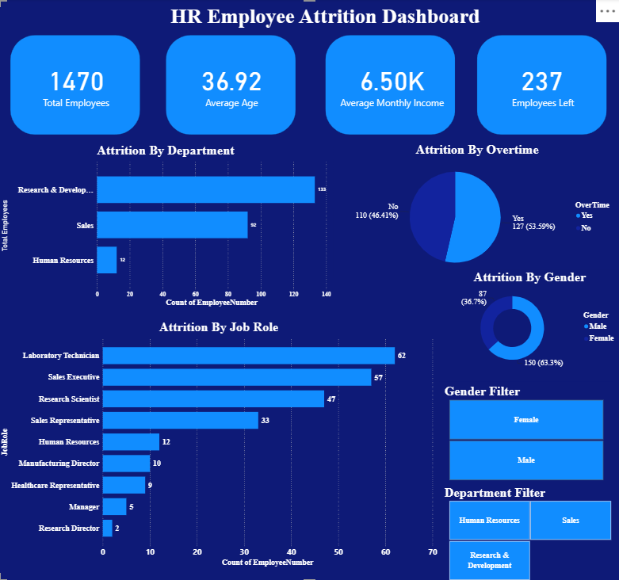

# 📊 HR Employee Attrition Dashboard (Power BI)

## 📌 Project Overview

This project presents an interactive **HR Employee Attrition Dashboard** built using **Microsoft Power BI**. The dashboard helps HR professionals and business stakeholders analyze employee attrition patterns and identify the major factors contributing to employee turnover.

---

## 🎯 Objective

To analyze employee attrition based on various factors such as:

- Department
- Job Role
- Gender
- Overtime
- Average Age
- Monthly Income

The dashboard provides interactive visualizations to support HR decision-making.

---

## 🛠️ Tools & Technologies Used

- Microsoft Power BI
- Power Query
- DAX
- CSV Dataset
- Data Visualization

---

## 📂 Dataset

**Dataset:** IBM HR Analytics Employee Attrition Dataset

---

## 📈 Dashboard Features

### KPI Cards
- 👥 Total Employees
- 🎂 Average Age
- 💰 Average Monthly Income
- 🚪 Employees Left (Attrition)

### Interactive Visualizations
- Attrition by Department
- Attrition by Job Role
- Attrition by Overtime
- Attrition by Gender

### Interactive Filters
- Gender Filter
- Department Filter

---

## 💡 Key Insights

- Research & Development department has the highest employee attrition.
- Laboratory Technician has the highest employee attrition among job roles.
- Employees working overtime are more likely to leave the organization.
- Male employees have slightly higher attrition than female employees.

---

## 📷 Dashboard Preview



---

## 📁 Repository Structure

```
Task-3-HR-Employee-Attrition-Dashboard
│
├── HR_Employee_Attrition_Dashboard.pbix
├── WA_Fn-UseC_-HR-Employee-Attrition.csv
├── README.md
│
└── Screenshots
    └── dashboard.png
```

---

## 🚀 Skills Demonstrated

- Data Visualization
- Dashboard Design
- Business Intelligence
- Power BI
- Power Query
- DAX
- KPI Development
- Interactive Reporting
- Data Analysis

---

## 📌 Conclusion

This dashboard enables HR teams to identify key attrition trends and supports data-driven decision-making by providing interactive insights into employee demographics, job roles, departments, overtime, and compensation.

---

## 👨‍💻 Author

**Muskan Saini**

GitHub: https://github.com/muskan-saini27

